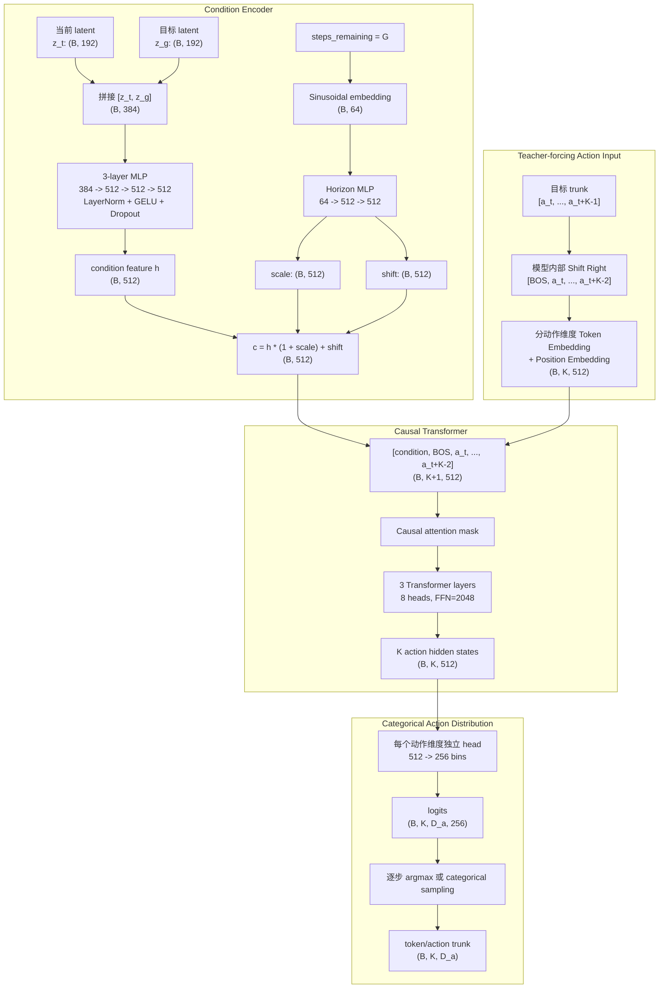

# Autoregressive K-step Token IDM

## 1. 目标

这个目录实现一个以冻结 LeWM latent 为条件的自回归 K-step Token IDM。模型接收当前 latent、目标 latent 和剩余目标步数：

$
(z_t,z_g,G)
$

并定义未来动作块的联合概率分布：

$$
p_\theta(a_{t:t+K-1}\mid z_t,z_g,G)
=
\prod_{i=0}^{K-1}
p_\theta(a_{t+i}\mid z_t,z_g,G,a_{t:t+i-1}).
$$

默认配置为：

$$
K=3,\qquad d_z=192,\qquad D_a=2,\qquad N_{\mathrm{bins}}=256.
$$

模型不使用显式的 $z_g-z_t$特征。Condition encoder 只输入 $[z_t,z_g]$，但保留 single-step Token IDM 的 horizon sinusoidal embedding 和 scale/shift 调制形式。

## 2. 模型架构



Condition 编码为：

$$
h=\operatorname{MLP}([z_t;z_g]),
$$

$$
e_G=\operatorname{HorizonMLP}\left(\operatorname{SinEmbed}\left(\frac{G}{G_{\max}}\right)\right),
$$

$$
c=h\odot(1+s(e_G))+b(e_G).
$$

训练时模型内部对目标 token 做 shift-right，因此第 \(i\) 个 hidden state只能看到 condition 和前 \(i-1\) 个真实动作。推理时使用模型自己生成的历史动作逐步生成完整 trunk。

## 3. 参数量

默认配置的可训练参数总量为：

$$
\boxed{11,531,776}
$$

| 模块 | 参数量 |
|---|---:|
| Condition + horizon encoder | 1,546,752 |
| Action/BOS/position embeddings | 264,192 |
| 3-layer causal Transformer | 9,457,152 |
| Final norm + categorical heads | 263,680 |
| 总计 | 11,531,776 |

## 4. 数据构建

Embedding archive 沿用 GC-IDM/single-step Token IDM 格式：

```text
embeddings:  (N, latent_dim)
actions:     (N, action_dim)
episode_ids: (N,)
```

默认每个训练样本为：

$$
(z_t,z_{t+25},G=25,a_t,a_{t+1},a_{t+2}).
$$

Dataset 保证：

1. action trunk 不跨 episode；
2. goal 和当前状态属于同一 episode；
3. trunk 内所有动作都是有限值；
4. 固定 goal 模式满足 \(G\ge K\)；
5. token label 形状保持为 `(K, action_dim)`，不会 flatten 时间维度。

`goal_sampling=fixed` 使用固定 `goal_offset`。`goal_sampling=uniform` 在：

$$
G\sim\operatorname{Uniform}(K,G_{\max})
$$

范围内按样本和 epoch 确定性采样。Validation/test 始终使用固定 goal，确保指标可复现。

## 5. Episode-level split

默认切分过程为：

1. 使用 `split_seed=42` 从全部 episode 中选择 10% test episodes；
2. 从剩余 90% 中选择 10% 作为 validation episodes；
3. 最终比例约为 81% train、9% val、10% test。

切分结果保存在：

```text
<experiment>/split_manifest.json
```

Train/val/test episode 互不重叠。Action tokenizer 的 bounds 或 q01/q99 只使用 train episodes 计算，避免验证集和测试集统计泄漏。

## 6. 训练目标与模型选择

训练损失为：

$$
\mathcal L
=
\mathcal L_{\mathrm{CE}}
+
\lambda_{\mathrm{L1}}\mathcal L_{\mathrm{L1}},
\qquad
\lambda_{\mathrm{L1}}=0.1.
$$

其中：

$$
\mathcal L_{\mathrm{CE}}
=
\frac{1}{KD_a}\sum_{i,d}
\operatorname{CE}(\ell_{i,d},b^*_{i,d}),
$$

$$
\mathcal L_{\mathrm{L1}}
=
\frac{1}{KD_a}\sum_{i,d}
\left|\mathbb E[a_{i,d}]-a^*_{i,d}\right|.
$$

Validation 同时计算：

- `teacher_*`：使用真实历史动作的 teacher-forced 指标；
- `free_*`：使用模型自身历史动作的 free-running 指标；
- `free_step_i_*`：每个 trunk 位置的误差和 token accuracy。

`best.pt` 由 validation `free_l1` 选择。Test split 不参与 checkpoint 选择。

## 7. 文件作用

| 文件 | 作用 |
|---|---|
| `model.py` | Condition encoder、causal Transformer、teacher-forcing forward、自回归 generate |
| `dataset.py` | 共享 embedding archive、episode-safe K-step 样本、固定/随机 goal |
| `splits.py` | 创建、保存、加载并验证 episode-level train/val/test manifest |
| `metrics.py` | Categorical expectation 解码、CE/L1 loss、teacher/free-running metrics |
| `extract.py` | 调用现有 LeWM extraction 路径生成 embedding `.npz` |
| `train.py` | Tokenizer、DataLoader、训练、validation、WandB、checkpoint/resume |
| `eval_offline.py` | 在 train/val/test embedding split 上运行离线评估 |
| `eval_rollout.py` | 在真实环境中在线编码观测并执行 closed-loop rollout |
| `tests/test_core.py` | 因果 mask、输出形状、episode split 和数据边界测试 |

## 8. 主要参数

### 模型参数

| 参数 | 默认值 | 含义 |
|---|---:|---|
| `action_horizon` | 3 | 自回归生成的动作数 \(K\) |
| `hidden_dim` | 512 | Condition 和 Transformer 特征维度 |
| `condition_layers` | 3 | Condition MLP 层数 |
| `transformer_layers` | 3 | Causal Transformer 层数 |
| `transformer_heads` | 8 | Attention heads |
| `transformer_ffn_dim` | 2048 | Transformer FFN 维度 |
| `n_bins` | 256 | 每个动作维度的 categorical bins |
| `max_goal_horizon` | 50 | Horizon embedding 的归一化上限 |
| `dropout` | 0.1 | MLP/Transformer dropout |

### 数据和训练参数

| 参数 | 默认值 | 含义 |
|---|---:|---|
| `goal_offset` | 25 | 当前帧到目标帧的距离 |
| `goal_sampling` | `fixed` | 固定目标或训练期 uniform 目标 |
| `batch_size` | 256 | 训练 batch size |
| `epochs` | 100 | 训练轮数 |
| `condition_lr` | `1e-4` | Condition encoder 学习率 |
| `decoder_lr` | `3e-4` | Transformer/head 学习率 |
| `warmup_epochs` | 5 | Linear warmup epochs |
| `weight_decay` | `1e-4` | AdamW weight decay |
| `grad_clip` | 1.0 | 全局梯度裁剪 |

### Closed-loop 参数

| 参数 | 默认值 | 含义 |
|---|---:|---|
| `execute_horizon` | 1 | 每次生成后实际执行多少步再重新规划 |
| `eval_budget` | 50 | 每个环境的最大控制预算 |
| `sample` | false | false 为 greedy，true 为 categorical sampling |
| `temperature` | 1.0 | Sampling temperature |
| `top_k` | none | 只从概率最高的 top-k bins 中采样 |

## 9. 远端 SSH 运行

### 9.1 登录和环境

在本地 PowerShell：

```powershell
ssh zflin@222.29.136.18
```

在远端：

```bash
source ~/miniconda3/etc/profile.d/conda.sh
conda activate lgp
cd /data/zflin/lewm_re/le-wm

export STABLEWM_HOME=/data/zflin/lewm_re/stablewm_data
export KSTEP_ROOT=/data/zflin/lewm_re/experiments/k_step_token_idm
mkdir -p "$KSTEP_ROOT/data" "$KSTEP_ROOT/runs"
```

所有 embedding、checkpoint、日志和评估结果都写到 `/data/zflin/lewm_re/experiments/`，不写入 repo。

### 9.2 提取 embedding

如果已有 single-step 使用的同一份 embedding `.npz`，可以直接复用并跳过本步骤。

```bash
CUDA_VISIBLE_DEVICES=0 python -B -m k_step_token_idm.extract \
  --checkpoint /data/zflin/lewm_re/stablewm_data/hf_pusht \
  --h5 /data/zflin/lewm_re/stablewm_data/datasets/pusht_expert_train.h5 \
  --output "$KSTEP_ROOT/data/pusht_lewm_embeddings.npz" \
  --batch-size 2048 \
  --num-prefetch 12 \
  --device cuda:0
```

### 9.3 完整宽度 smoke run

Smoke run 保持正式模型宽度，只减少 epoch 和样本计算量：

```bash
CUDA_VISIBLE_DEVICES=0 python -B -m k_step_token_idm.train \
  --embeddings "$KSTEP_ROOT/data/pusht_lewm_embeddings.npz" \
  --output "$KSTEP_ROOT/runs/k3_g25_smoke" \
  --action-horizon 3 \
  --goal-offset 25 \
  --goal-sampling fixed \
  --batch-size 256 \
  --epochs 2 \
  --warmup-epochs 0 \
  --checkpoint-every 1 \
  --device cuda:0
```

Smoke run 后检查：

```bash
ls -lh "$KSTEP_ROOT/runs/k3_g25_smoke"
cat "$KSTEP_ROOT/runs/k3_g25_smoke/history.json"
```

### 9.4 tmux 正式训练

```bash
tmux new -s kstep_k3
```

在 tmux 中：

```bash
source ~/miniconda3/etc/profile.d/conda.sh
conda activate lgp
cd /data/zflin/lewm_re/le-wm
export STABLEWM_HOME=/data/zflin/lewm_re/stablewm_data
export KSTEP_ROOT=/data/zflin/lewm_re/experiments/k_step_token_idm

CUDA_VISIBLE_DEVICES=0 python -B -m k_step_token_idm.train \
  --embeddings "$KSTEP_ROOT/data/pusht_lewm_embeddings.npz" \
  --output "$KSTEP_ROOT/runs/k3_g25_full" \
  --action-horizon 3 \
  --goal-offset 25 \
  --goal-sampling fixed \
  --max-goal-horizon 50 \
  --n-bins 256 \
  --hidden-dim 512 \
  --condition-layers 3 \
  --transformer-layers 3 \
  --transformer-heads 8 \
  --transformer-ffn-dim 2048 \
  --batch-size 256 \
  --epochs 100 \
  --condition-lr 1e-4 \
  --decoder-lr 3e-4 \
  --warmup-epochs 5 \
  --checkpoint-every 10 \
  --wandb \
  --wandb-project k-step-token-idm \
  --wandb-run-name pusht_k3_g25_full \
  --device cuda:0 2>&1 | tee "$KSTEP_ROOT/runs/k3_g25_full.log"
```

按 `Ctrl-b`、再按 `d` 离开 tmux。重新进入：

```bash
tmux attach -t kstep_k3
```

### 9.5 断点续训

```bash
CUDA_VISIBLE_DEVICES=0 python -B -m k_step_token_idm.train \
  --embeddings "$KSTEP_ROOT/data/pusht_lewm_embeddings.npz" \
  --output "$KSTEP_ROOT/runs/k3_g25_full" \
  --action-horizon 3 \
  --goal-offset 25 \
  --batch-size 256 \
  --epochs 100 \
  --resume "$KSTEP_ROOT/runs/k3_g25_full/last.pt" \
  --device cuda:0
```

断点续训必须使用与 checkpoint 相同的模型、tokenizer 和 split 参数。

## 10. 离线评估

Validation free-running 评估：

```bash
CUDA_VISIBLE_DEVICES=0 python -B -m k_step_token_idm.eval_offline \
  --checkpoint "$KSTEP_ROOT/runs/k3_g25_full/best.pt" \
  --embeddings "$KSTEP_ROOT/data/pusht_lewm_embeddings.npz" \
  --partition val \
  --batch-size 256 \
  --device cuda:0 \
  --output "$KSTEP_ROOT/runs/k3_g25_full/offline_val.json"
```

最终 held-out test 评估：

```bash
CUDA_VISIBLE_DEVICES=0 python -B -m k_step_token_idm.eval_offline \
  --checkpoint "$KSTEP_ROOT/runs/k3_g25_full/best.pt" \
  --embeddings "$KSTEP_ROOT/data/pusht_lewm_embeddings.npz" \
  --partition test \
  --batch-size 256 \
  --device cuda:0 \
  --output "$KSTEP_ROOT/runs/k3_g25_full/offline_test.json"
```

这里的结果是 held-out embedding transitions 上的离线指标，不是真实环境闭环控制结果。

## 11. 真实环境 closed-loop rollout

### 11.1 Greedy，每步重新规划

这是与 single-step Token IDM 最公平的比较：

```bash
CUDA_VISIBLE_DEVICES=0 MUJOCO_GL=egl python -B -m k_step_token_idm.eval_rollout \
  --dataset pusht \
  --idm "$KSTEP_ROOT/runs/k3_g25_full/best.pt" \
  --lewm-checkpoint /data/zflin/lewm_re/stablewm_data/hf_pusht \
  --partition test \
  --num-eval 100 \
  --goal-offset 25 \
  --eval-budget 50 \
  --execute-horizon 1 \
  --device cuda:0 \
  --output "$KSTEP_ROOT/runs/k3_g25_full/closed_loop_test_exec1.json"
```

### 11.2 执行完整 K=3 trunk

```bash
CUDA_VISIBLE_DEVICES=0 MUJOCO_GL=egl python -B -m k_step_token_idm.eval_rollout \
  --dataset pusht \
  --idm "$KSTEP_ROOT/runs/k3_g25_full/best.pt" \
  --lewm-checkpoint /data/zflin/lewm_re/stablewm_data/hf_pusht \
  --partition test \
  --num-eval 100 \
  --goal-offset 25 \
  --eval-budget 50 \
  --execute-horizon 3 \
  --device cuda:0 \
  --output "$KSTEP_ROOT/runs/k3_g25_full/closed_loop_test_exec3.json"
```

### 11.3 Categorical sampling

```bash
CUDA_VISIBLE_DEVICES=0 MUJOCO_GL=egl python -B -m k_step_token_idm.eval_rollout \
  --dataset pusht \
  --idm "$KSTEP_ROOT/runs/k3_g25_full/best.pt" \
  --lewm-checkpoint /data/zflin/lewm_re/stablewm_data/hf_pusht \
  --partition test \
  --num-eval 100 \
  --goal-offset 25 \
  --eval-budget 50 \
  --execute-horizon 1 \
  --sample \
  --temperature 0.8 \
  --top-k 32 \
  --device cuda:0 \
  --output "$KSTEP_ROOT/runs/k3_g25_full/closed_loop_test_sample_t08_top32.json"
```

Closed-loop JSON 会保存环境 metrics、episode/start IDs、wall-clock、平均 replan 时间、平均 action call 时间和 replanning 次数。它来自 held-out test episodes 上的真实环境 rollout。

## 12. 输出目录

完整训练后：

```text
/data/zflin/lewm_re/experiments/k_step_token_idm/
├── data/
│   └── pusht_lewm_embeddings.npz
└── runs/
    └── k3_g25_full/
        ├── best.pt
        ├── last.pt
        ├── history.json
        ├── split_manifest.json
        ├── checkpoints/
        │   ├── epoch_0010.pt
        │   └── ...
        ├── offline_val.json
        ├── offline_test.json
        ├── closed_loop_test_exec1.json
        └── closed_loop_test_exec3.json
```

## 13. 本地检查

```bash
python -B -m compileall -q k_step_token_idm
python -B -m unittest k_step_token_idm.tests.test_core -v
```

真实 closed-loop 需要安装 `stable_worldmodel`、MuJoCo 和对应环境，因此应在远端 `lgp` 环境运行。
