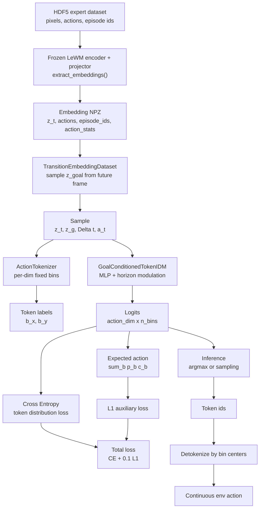

# Single-Step Token IDM 代码说明

这个目录实现的是“**先不做 ACT，只做单步预测**”的版本。

目标形式：

$$
\pi_\theta(a_t \mid z_t, z_g, \Delta t)
$$

其中动作不直接回归，而是按维度做固定分箱，输出离散分布。

---

## 1. 架构流程图



默认训练目标：

$$
\mathcal{L}
=
\mathcal{L}_{\text{CE}}
+ 0.1\,\mathcal{L}_{\text{L1}}
$$

这里默认不加 entropy 正则，即：

$$
\beta = 0
$$

---

## 2. 文件结构

```text
single_step_token_idm/
  __init__.py
  extract.py
  tokenization.py
  dataset.py
  model.py
  train.py
  eval.py
  PLAN.md
```

---

## 3. 每个代码文件的功能与参数

### 3.1 `tokenization.py`

功能：

- 把连续动作归一化到 $[-1, 1]$
- 按每个动作维度做固定分箱
- 把 token id 反解码回连续动作
- 提供从 logits 计算动作期望值的工具

主要接口：

- `ActionTokenizerConfig`
  - `action_dim`: 动作维度数
  - `n_bins`: 每个维度的离散 bin 数
  - `normalization`: 使用 `bounds` 或 `bounds_q99`
  - `token_offset`: token 偏移量
  - `eps`: 数值稳定项

- `compute_action_stats(actions, use_q99=True)`
  - 从原始动作数组统计 `min/max/q01/q99`

- `ActionTokenizer.from_stats(stats, cfg)`
  - 用数据集统计量构造 tokenizer

- `ActionTokenizer.actions_to_token_ids(actions)`
  - 连续动作 $\rightarrow$ token id

- `ActionTokenizer.token_ids_to_actions(token_ids)`
  - token id $\rightarrow$ 连续动作

- `ActionTokenizer.expected_actions_from_logits(logits)`
  - 从 categorical logits 求动作期望，用于辅助 L1 loss

---

### 3.2 `dataset.py`

功能：

- 从 GC-IDM 风格的 LeWM checkpoint 提取冻结 latent
- 从 HDF5 数据集读像素、动作、episode 信息
- 生成 `(z_t, z_goal, steps_remaining, action)` 样本
- 可选地把 action 预先转成 token label

主要接口：

- `load_lewm_model(checkpoint_path, device="cpu")`
  - 支持 `_object.ckpt`、`config.json + weights.pt`、HF repo id

- `extract_embeddings(checkpoint_path, h5_path, output_path, ...)`
  - 复用 GC-IDM 的 frozen encoder + projector 提取流程
  - 保存 `embeddings / actions / episode_ids / action_stats`

- `TransitionEmbeddingDataset(...)`
  - `embeddings_path`: `extract_embeddings()` 的输出
  - `max_goal_horizon`: 采样目标帧的最大距离
  - `frameskip`: 连续帧动作拼接长度，默认 1
  - `train_split`: episode 级划分比例
  - `split_seed`: episode 划分随机种子
  - `split_partition`: `train` 或 `val`
  - `tokenizer`: 可选，传入后返回 `action_tokens`

- `TransitionEmbeddingDataset.set_tokenizer(tokenizer)`
  - 把 tokenizer 挂到 dataset 上，训练时直接取 token label

---

### 3.3 `model.py`

功能：

- 冻结 encoder 后，学习 goal-conditioned 单步动作分布
- 输出每个动作维度上的 categorical logits

主要接口：

- `TokenIDMConfig`
  - `embed_dim`: latent 维度
  - `action_dim`: 动作维度
  - `n_bins`: 每维 bin 数
  - `hidden_dim`: MLP 隐藏层宽度
  - `n_layers`: backbone 层数
  - `dropout`: dropout 比例
  - `activation`: `gelu` / `relu` / `silu`
  - `noise_sigma`: 训练时输入噪声
  - `max_horizon`: horizon 归一化上限
  - `time_embed_dim`: 时间编码维度
  - `use_goal_delta`: 是否拼接 `z_g - z_t`

- `GoalConditionedTokenIDM.forward(z_t, z_goal, steps_remaining)`
  - 输出 shape 为 `(B, action_dim, n_bins)`

- `GoalConditionedTokenIDM.predict_token_ids(logits, do_sample=False, temperature=1.0)`
  - 从 logits 采样或 argmax token

- `GoalConditionedTokenIDM.entropy(logits)`
  - 计算分布熵，供正则项使用

---

### 3.4 `extract.py`

功能：

- 提供 `extract_embeddings()` 的命令行入口
- 从 frozen LeWM checkpoint 和 HDF5 数据集中提取 latent
- 保存后续训练需要的 `.npz`

主要参数：

- `--checkpoint`: LeWM checkpoint 路径
- `--h5`: HDF5 数据集路径
- `--output`: 输出 `.npz` 路径
- `--img-size`: 图像尺寸，默认 `224`
- `--batch-size`: encoder 提取 batch size，默认 `2048`
- `--num-prefetch`: HDF5 预取线程数，默认 `12`
- `--device`: 默认 `cuda:0`
- `--no-q99-stats`: 关闭 q01/q99 动作统计

---

### 3.5 `train.py`

功能：

- 训练单步 token IDM
- 支持 CE + L1 + entropy 的组合 loss
- 保存 checkpoint 与 history

主要参数：

- `--embeddings`: `extract_embeddings()` 产生的 `.npz`
- `--output`: checkpoint 输出路径
- `--max-goal-horizon`: 目标采样最大步数
- `--frameskip`: 连续动作拼接长度
- `--train-split`: episode 训练划分比例
- `--split-seed`: episode 划分随机种子
- `--split-partition`: `train` / `val`
- `--batch-size`
- `--epochs`
- `--lr`
- `--weight-decay`
- `--hidden-dim`
- `--n-layers`
- `--dropout`
- `--activation`
- `--n-bins`
- `--normalization`
- `--token-offset`
- `--l1-coef`: 默认 `0.1`
- `--entropy-coef`: 默认 `0.0`，也就是默认 $\beta=0$
- `--noise-sigma`
- `--device`
- `--no-wandb`: 关闭 wandb；默认开启 wandb
- `--wandb-project`: wandb project，默认 `single-step-token-idm`
- `--wandb-entity`: wandb entity，可不填
- `--wandb-run-name`: wandb run 名称，可不填
- `--wandb-mode`: `online` / `offline` / `disabled`
- `--wandb-tags`: wandb tags
- `--wandb-log-artifact`: 上传 best checkpoint 和 history 为 artifact

训练损失：

$$
\mathcal{L}
=
\mathcal{L}_{\text{CE}}
+ \lambda_{\text{L1}}\mathcal{L}_{\text{L1}}
- \beta H
$$

当前默认值：

$$
\lambda_{\text{L1}} = 0.1,\quad \beta = 0
$$

---

### 3.6 `eval.py`

功能：

- 加载训练好的 checkpoint
- 在 embedding 数据集上评估
- 输出 CE / L1 / token accuracy

主要参数：

- `--embeddings`
- `--checkpoint`
- `--batch-size`
- `--device`

---

## 4. 远端 SSH 实验命令顺序

下面命令假设远端仓库在：

```bash
/data/zflin/lewm_re/cadenlbg-le-wm
```

如果实际路径不同，先替换 `REPO`。

### 4.1 进入远端环境

```bash
ssh zflin@222.29.136.18
```

```bash
cd /data/zflin/lewm_re/cadenlbg-le-wm
conda activate lewm
export PYTHONPATH=$PWD:$PYTHONPATH
export STABLEWM_HOME=/data/zflin/lewm_re
```

### 4.2 准备路径

```bash
export REPO=/data/zflin/lewm_re/cadenlbg-le-wm
export CKPT=/data/zflin/lewm_re/checkpoints/pusht/lewm
export H5=/data/zflin/lewm_re/datasets/pusht_expert_train.h5
export OUT=/data/zflin/lewm_re/experiments/single_step_token_idm
mkdir -p $OUT
```

如果数据集实际名字不是 `pusht_expert_train.h5`，先用：

```bash
find /data/zflin/lewm_re -name "pusht*train*.h5" -o -name "pusht*.h5"
```

### 4.3 提取 frozen LeWM embeddings

```bash
python -m single_step_token_idm.extract \
  --checkpoint /data/zflin/lewm_re/checkpoints/pusht/lewm \
  --h5 /data/zflin/lewm_re/datasets/pusht_expert_train.h5 \
  --output /data/zflin/lewm_re/experiments/single_step_token_idm/pusht_embeddings.npz \
  --img-size 224 \
  --batch-size 2048 \
  --num-prefetch 12 \
  --device cuda:0
```

### 4.4 训练单步 token IDM

```bash
python -m single_step_token_idm.train \
  --embeddings /data/zflin/lewm_re/experiments/single_step_token_idm/pusht_embeddings.npz \
  --output /data/zflin/lewm_re/experiments/single_step_token_idm/token_idm.pt \
  --max-goal-horizon 50 \
  --frameskip 1 \
  --train-split 0.9 \
  --split-seed 42 \
  --batch-size 512 \
  --epochs 100 \
  --lr 3e-4 \
  --weight-decay 1e-4 \
  --hidden-dim 512 \
  --n-layers 3 \
  --n-bins 256 \
  --normalization bounds_q99 \
  --l1-coef 0.1 \
  --entropy-coef 0.0 \
  --wandb-project single-step-token-idm \
  --wandb-run-name pusht-token-idm-baseline \
  --device cuda:0
```

wandb 默认开启。如果远端没有登录 wandb，先运行：

```bash
wandb login
```

如果只想离线记录：

```bash
export WANDB_MODE=offline
```

如果本次不想用 wandb：

```bash
python -m single_step_token_idm.train \
  --embeddings /data/zflin/lewm_re/experiments/single_step_token_idm/pusht_embeddings.npz \
  --output /data/zflin/lewm_re/experiments/single_step_token_idm/token_idm.pt \
  --no-wandb
```

### 4.5 评估 embedding-level 指标

```bash
python -m single_step_token_idm.eval \
  --embeddings /data/zflin/lewm_re/experiments/single_step_token_idm/pusht_embeddings.npz \
  --checkpoint /data/zflin/lewm_re/experiments/single_step_token_idm/token_idm.pt \
  --batch-size 512 \
  --device cuda:0
```

### 4.6 建议用 tmux 跑长实验

```bash
tmux new -s token-idm
cd /data/zflin/lewm_re/cadenlbg-le-wm
conda activate lewm
export PYTHONPATH=$PWD:$PYTHONPATH
export STABLEWM_HOME=/data/zflin/lewm_re
```

然后依次执行 `4.3`、`4.4`、`4.5`。

---

## 5. 借鉴来源

### 5.1 GC-IDM 的借鉴点

借鉴并适配了以下思路：

- `other exp/Latent-Geometry-Beyond-Search-Amortizing-Planning-in-World-Models/idm/model.py`
  - 冻结 latent 上的 goal-conditioned inverse dynamics MLP
  - `z_t + z_goal + steps_remaining` 的输入组织
  - AdaLN 风格的 horizon modulation

- `other exp/Latent-Geometry-Beyond-Search-Amortizing-Planning-in-World-Models/idm/dataset.py`
  - `extract_embeddings()` 的 frozen LeWM encoder / projector 抽取流程
  - episode 级切分
  - 从未来帧采样 goal

- `other exp/Latent-Geometry-Beyond-Search-Amortizing-Planning-in-World-Models/eval_idm.py`
  - goal 缓存
  - 单步闭环执行

### 5.2 SimpleVLA-RL 的借鉴点

借鉴并适配了以下思路：

- `SimpleVLA-RL/verl/utils/vla_utils/openvla_oft/modeling_prismatic.py`
  - 固定分箱
  - `bin_centers`
  - token id 与离散动作的映射 / 反映射

- `SimpleVLA-RL/verl/utils/vla_utils/openvla_oft/train_utils.py`
  - 动作 token 的分类监督思路
  - token accuracy 与动作级 L1 评估思路

---

## 6. 这版实现的边界

当前实现只做：

- 单步预测
- per-dim 离散动作分布
- 冻结 LeWM latent

暂时不做：

- ACT 风格 chunk policy
- diffusion policy
- GRPO / PPO 微调
